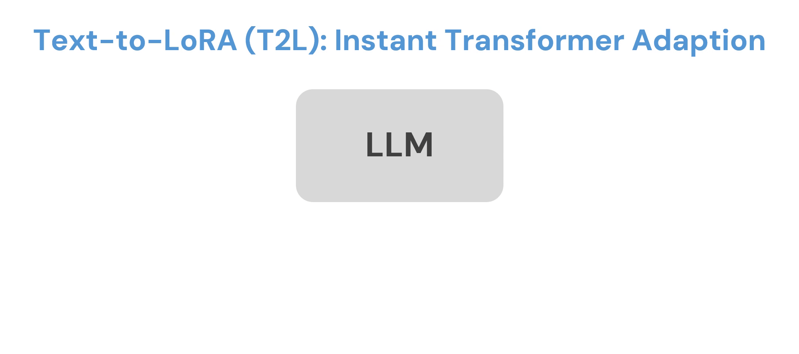

# Text-to-LoRA (T2L): Instant Transformer Adaption
<div align="center">
    :newspaper:<a href="https://x.com/SakanaAILabs">Tweet</a> |
    :scroll:<a href="https://openreview.net/forum?id=zWskCdu3QA">Paper</a> |
    :hugs:<a href="https://huggingface.co/SakanaAI">Hugging Face</a> |
    :octocat:<a href="https://github.com/SakanaAI/text-to-lora">GitHub</a>
<br>A reference implementation of Text-to-LoRA (T2L).<br>
</div>
<div align="center">
    
</div>

---

<h1 align="center">🛠️ Installation</h1>

Install `uv` if you don't have `uv` (see https://docs.astral.sh/uv/getting-started/installation/)

With `uv` installed, run the following to install the dependencies.
```bash
git clone https://github.com/SakanaAI/text-to-lora.git
cd text-to-lora
# make sure you have `uv` installed
# (see https://docs.astral.sh/uv/getting-started/installation/)
uv self update
uv venv --python 3.10 --seed
uv sync
# we use the following wheel for installation
# you might have to change the wheel to be compatible with your hardware
uv pip install https://github.com/Dao-AILab/flash-attention/releases/download/v2.6.3/flash_attn-2.6.3+cu123torch2.3cxx11abiFALSE-cp310-cp310-linux_x86_64.whl
uv pip install src/fishfarm
```

---

<h1 align="center">🚀 Demo</h1>

***Downloading trained T2L***

:warning: **You need to download the checkpoints before running any of the demos.** :warning:

:warning: **You need a >16GB GPU to handle both models simultaneously to run any of these demos.** :warning:
```bash
uv run huggingface-cli login
uv run huggingface-cli download SakanaAI/text-to-lora --local-dir . --include "trained_t2l/*"
```

***Web UI***

This demo runs `Mistral-7B-Instruct-v0.2` locally alongside a T2L model.
```bash
# start webui locally
uv run python webui/app.py
```
<div align="center">
    
</div>


***LoRA generation from CLI***

This script allows us to generate a LoRA based on a task description. Running for the first time would take longer as the base model will be downloaded and cached.
```bash
# uv run generate_lora.py {T2l_DIRECTORY} {TASK_DESCRIPTION}
# e.g.,
uv run python scripts/generate_lora.py \
trained_t2l/llama_8b_t2l \
"This task challenges your problem-solving abilities through mathematical reasoning. You must carefully read each scenario and systematically work through the data to compute the final outcome."

# You might be able to run T2L w/ `gemma-2-2b-it` with a smaller GPU.
uv run python scripts/generate_lora.py \
trained_t2l/gemma_2b_t2l \
"This task challenges your problem-solving abilities through mathematical reasoning. You must carefully read each scenario and systematically work through the data to compute the final outcome."
```

***Evaluating generated LoRA***

We can evaluate the generated LoRA by using the path printed at the end of the above script.
```bash
# uv run python scripts/run_eval.py --model-dir {base_model_dir} \
# --lora-dirs {lora_dirs} --save-results --tasks {tasks}
# e.g.,
uv run python scripts/run_eval.py \
--model-dir meta-llama/Llama-3.1-8B-Instruct \
--lora-dirs {PATH_TO_GENERATED_LORA} \
--save-results --tasks gsm8k

# You might be able to run T2L w/ `gemma-2-2b-it` with a smaller GPU.
uv run python scripts/run_eval.py \
--model-dir google/gemma-2-2b-it \
--lora-dirs {PATH_TO_GENERATED_LORA} \
--save-results --tasks gsm8k
```

> ***Disclaimer :grey_exclamation:***
> 
> Even with random descriptions, SFT-trained T2L still generates reasonable LoRAs.
> This result with SFT-trained T2L differs from Table 5 in the paper that uses reconstruction-trained T2L.
> Nonetheless, comparing the results obtained between aligned and unaligned descriptions, aligned LoRAs perform noticeably better overall. The training descriptions can be found in `tasks/` folder, while the unseen ones used for evaluation can be found in `configs/hyper_lora_decontam_lol_tasks.yaml`

---
<h1 align="center">🏋️ Training</h1>
<div align="center">
    
</div>

<h2 align="center">👩‍🏫 SFT Training</h2>
For asynchronous validation evaluation, we need a separate evaluator script.
The `watcher.py` checks for new checkpoints and evaluates them as they get saved.
The script also keeps track of which one is the best checkpoint so far.

```bash
# start a watcher process for async eval
uv run watcher.py
```

Then run one of the following scripts for each GPU you have.
Each takes around 5 days on a single H100 GPU.
```bash
# T2L training
./scripts/train_t2l_mistral.sh
./scripts/train_t2l_llama.sh
./scripts/train_t2l_gemma.sh
```

---

<h2 align="center">🏗️ Reconstruction Training</h2>
First, we need to train the "oracle" adapters for all tasks.
This script trains hundreds of LoRAs and might run for many hours.

```bash
./scripts/train_lora_baselines.sh
```

Then, we train T2L to reconstruct the oracle adapters.
```bash
# train T2L via reconstruction training
WANDB_MODE=disabled uv run python scripts/train_hyper_recon.py configs/hyper_lora_decontam_lol_tasks.yaml \
--model_dir=mistralai/Mistral-7B-Instruct-v0.2/ \
--emb_model=Alibaba-NLP/gte-large-en-v1.5 \
--warmup_frac=0.1 --lr=1e-3 --epochs=10000 \
--n_train_ds=479 --exp_setup=hyper_lora --encoder_type=linear \
--pred_z_score=True --n_descs_per_ds=128 --n_embs_per_sampled_task=1 \
--n_tasks_per_batch=4 --factorized=False --delta_w_scaling=10000 --shared_AB_head=True
```

---

<h1 align="center">📊 Evaluation</h1>

Base model
```bash
./scripts/eval_base_models.sh
```

T2L
```bash
# example for T2L trained for gemma-2-2b-it
WANDB_MODE=disabled uv run python scripts/eval_hypermod_checkpoint.py --checkpoint_path trained_t2l/gemma_2b_t2l/hypermod.pt --full_eval --use-icl
```
`--use-icl` includes 3-shot in-context examples into evaluation queries.

---

<h1 align="center">:warning: Known Issues :warning:</h1>

### :test_tube: Reproducibility
> ***Disclaimer :grey_exclamation:***
> 
> We have re-trained a new set of baselines and T2L models due to a small mismatch
> between the specific package version combinations used in the original submission.
> 
> Furthermore, vLLM is inherently non-deterministic when applying LoRA (in the version-configuration combinations we tested).
> Thus, we have observed some small variance between evaluation runs even with a fixed initial seed.
> 
> However, after re-retraining and collecting new results, T2L still consistently outperforms baselines across model families, confirming the validity of our original empirical analysis. We present this new set of results with the updated package versions in the following tables.
> (`eval #1` and `eval #2` indicate that the results are gathered from two different evaluation calls with the same random seed.)

***Mistral-7B-Instruct-v0.2***
| Model                   | ArcC (acc) | ArcE (acc) | BoolQ (acc) | GSM8K (acc) |  HS (acc) | OQA (acc) | PIQA (acc) |  WG (acc) | HE (pass@1) | MBPP (pass@1) |    AVG    |
|-------------------------|:----------:|:----------:|:-----------:|:-----------:|:---------:|:---------:|:----------:|:---------:|:-----------:|:-------------:|:---------:|
| Mistral-7B              |    65.79   |    77.74   |    71.56    |    41.02    |   49.64   |   54.20   |    72.96   |   45.07   |    39.02    |     42.61     |   55.96   |
| Mistral-7B w/ ICL       |    72.01   |    86.03   |    71.80    |    41.02    |   59.15   |   65.60   |    76.33   |   58.09   |    39.02    |     41.35     |   61.04   |
| Mistral-7B w/ task desc |    61.86   |    77.53   |    71.50    |    41.02    |   45.08   |   56.20   |    69.75   |   47.59   |    38.41    |     39.60     |   54.85   |
| MT LoRA (eval #1)       |    76.54   |  **89.27** |  **85.23**  |  **46.47**  |   67.11   |   72.40   |  **82.81** |   62.51   |    39.02    |     45.36     |   66.67   |
| MT LoRA (eval #2)       |    76.54   |  **89.27** |  **85.23**  |    45.64    |   67.10   |   72.40   |  **82.81** |   62.51   |  **39.63**  |     46.12     |   66.73   |
| Hyperdecoders (eval #1) |    76.62   |    88.38   |    84.34    |    46.10    | **67.25** |   72.60   |    82.48   |   62.83   |    35.37    |   **52.88**   |   66.89   |
| Hyperdecoders (eval #2) |    77.05   |    88.38   |    84.46    |    45.49    |   66.73   |   73.20   |    81.94   |   62.35   |    35.98    |     52.38     |   66.80   |
| T2L (eval #1)           |  **77.42** |    89.20   |    84.62    |    44.02    |   67.08   | **75.07** |    82.32   | **63.14** |    38.62    |     48.71     |   67.02   |
| T2L (eval #2)           |  **77.42** |    89.20   |    84.62    |    44.20    |   67.07   | **75.07** |    82.32   | **63.14** |    38.62    |     48.87     | **67.05** |

***Llama-3.1-8B-Instruct***
| Model                 | ArcC (acc) | ArcE (acc) | BoolQ (acc) | GSM8K (acc) |  HS (acc) | OQA (acc) | PIQA (acc) |  WG (acc) | HE (pass@1) | MBPP (pass@1) |    AVG    |
|-----------------------|:----------:|:----------:|:-----------:|:-----------:|:---------:|:---------:|:----------:|:---------:|:-----------:|:-------------:|:---------:|
| Llama-8B              |    73.29   |    90.53   |    80.40    |    75.36    |   66.53   |   75.40   |    79.60   |   55.01   |    65.24    |     68.92     |   73.03   |
| Llama-8B w/ ICL       |    80.80   |    91.96   |    79.88    |    75.36    |   59.19   |   78.00   |    80.63   | **61.64** |    65.24    |     69.17     |   74.19   |
| Llama-8B w/ task desc |    72.78   |    90.95   |    76.57    |    75.36    |   63.21   |   73.00   |    80.52   |   56.20   |  **67.07**  |   **70.93**   |   72.66   |
| MT LoRA (eval #1)     |    82.42   |  **93.18** |    84.40    |    76.35    |   73.88   |   81.80   |    81.94   |   60.38   |    62.20    |     69.42     |   76.60   |
| MT LoRA (eval #2)     |    82.42   |  **93.18** |  **84.43**  |    76.88    | **73.89** |   81.80   |    81.94   |   60.30   |    62.20    |     69.67     |   76.67   |
| T2L (eval #1)         |  **82.82** |    93.04   |    84.23    |  **77.05**  |   73.84   |   82.07   |  **82.12** |   61.19   |    64.63    |   **70.93**   | **77.19** |
| T2L (eval #2)         |    82.65   |    93.15   |    84.34    |    76.98    |   73.88   | **82.13** |    82.06   |   61.38   |    64.23    |     70.09     |   77.09   |

***Gemma-2-2b-it***
| Model                   | ArcC (acc) | ArcE (acc) | BoolQ (acc) | GSM8K (acc) |  HS (acc) | OQA (acc) | PIQA (acc) |  WG (acc) | HE (pass@1) | MBPP (pass@1) |    AVG    |
|-------------------------|:----------:|:----------:|:-----------:|:-----------:|:---------:|:---------:|:----------:|:---------:|:-----------:|:-------------:|:---------:|
| gemma-2-2b-it           |    73.63   |    89.86   |    80.98    |    55.27    |   54.99   |   70.80   |    70.84   |   53.83   |  **43.90**  |     13.53     |   60.76   |
| gemma + ICL             |    72.10   |    88.80   |  **82.29**  |    55.27    |   55.59   |   72.20   |    67.68   |   53.35   |  **43.90**  |     43.36     |   63.45   |
| gemma + ICL + task desc |    72.10   |    88.80   |  **82.29**  |    55.27    |   55.59   |   72.20   |    67.68   |   53.35   |  **43.90**  |     43.36     |   63.45   |
| mt lora + ICL (#eval1)  |    74.06   |    88.80   |    81.01    |    56.41    |   60.09   | **74.40** |    68.17   | **58.01** |    39.63    |     50.13     |   65.07   |
| mt lora + ICL (#eval2)  |    74.06   |    88.80   |    81.04    |    56.56    |   60.10   | **74.40** |    68.17   | **58.01** |    39.63    |     49.87     |   65.06   |
| T2L + ICL (#eval1)      |  **74.12** |  **90.03** |    82.27    |    56.61    | **62.87** |   74.33   |  **73.61** |   57.51   |    39.02    |   **50.54**   |   66.09   |
| T2L + ICL (#eval2)      |  **74.12** |  **90.03** |    82.27    |  **56.89**  |   62.86   |   74.33   |  **73.61** |   57.51   |    39.02    |   **50.54**   | **66.12** |

### 📡 Huggingface datasets connection

Huggingface datasets server might reject connections sometimes, which can be problematic if you haven't locally cached the relevant datasets.
The cause could be that we're downloading a lot of datasets (~500 datasets).
If this happens, keep retrying the SFT training script until all datasets are cached locally.
Once the datasets are cached, you should be able to run the SFT training script.

---

# 📖 BibTex
```bibtex
@inproceedings{
    charakorn2025texttolora,
    title={Text-to-Lo{RA}: Instant Transformer Adaption},
    author={Rujikorn Charakorn and Edoardo Cetin and Yujin Tang and Robert Tjarko Lange},
    booktitle={Forty-second International Conference on Machine Learning},
    year={2025},
    url={https://openreview.net/forum?id=zWskCdu3QA}
}
```
